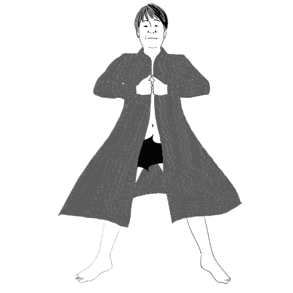

# 卑猥.city

## 1.はじめに
卑猥.city(ひわいどっとシティ)は、世の中のいわゆる不審者等の出現エリアを登録し、リアルタイムに可視化する防犯サービスである。

## 2. 製品概要
ユーザは不審者の出現場所を登録することができ、かつ迅速に不審者が発生したエリアを確認し、安全な帰宅ルートの確保が可能となる。

### 背景(製品開発のきっかけ、課題等）
**いわゆる不審者マップをもっと便利に使いやすくわかりやすくしたい**

- 既存サービス
  - http://www.3s-sys.co.jp/tokyo-fushinsha-map/
  - http://anzn.net/tokyo/safety/index.html
正直よくわからんです。後者とか日付が未来なのがあったりで適当。

- 卑猥な対象者
  - ストーカー
  - 不審者
  - 露出狂
  - NH◯K受信料徴収
  - 新聞勧誘
  - エ◯ホバ
  - バラ◯モン
  - ◯オウム

## 3. 使用方法
マップ上の任意の場所をクリックするとピン(おじさん)を置くだけ

## 4. 特長
- マップ上の任意の場所をクリックするとピン(おじさん)を置ける
- 危ない場所が瞬時にわかる
- 匿名で情報提供できる
- 子供でもわかりやすい

## 5. 注力したこと（こだわり等）
- 気持ち悪いおっさんのビジュアル(選択可能)

|ossan_1|ossan_2|ossan_special|
|---|---|---|
||||

## 6. 今後の展望
- 警視庁との連携
  - 警視庁データベース
- ピーポくん設置

## 7. 技術的情報など

### 活用した技術
- Firebase
- Google Maps API
- AWS

#### デバイス
- ブラウザ

### 独自技術
- おじさん
- 堀口
